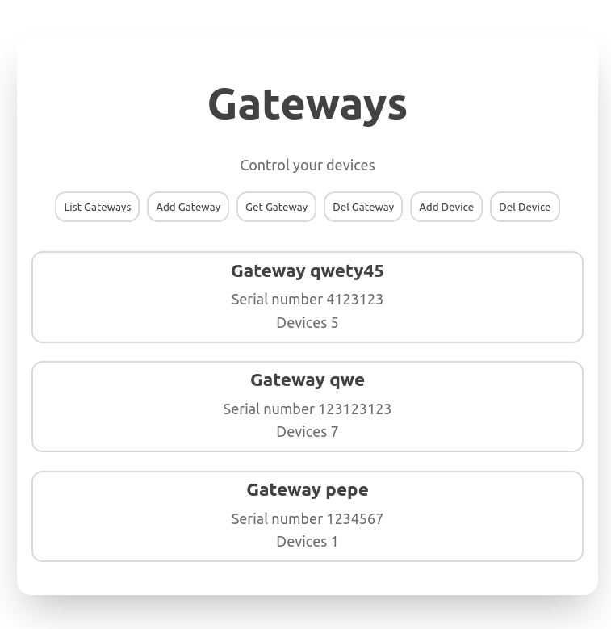

# Musala Soft Gateways task

## Table of contents

- [Overview](#overview)
  - [The task](#the-task)
  - [Screenshot](#screenshot)
  - [Links](#links)
- [My process](#my-process)
  - [Built with](#built-with)
- [Installation](#installation)
  - [Local install](#local-install)
  - [Remote install](#remote-install)
- [Usage](#usage)
  - [Front-end](#front-end)
  - [Back-end](#back-end)
- [Author](#author)

## Overview

### The task

Software Requirements
Programming language: JavaScript
Framework: Node.js/JavaScript + Angular/React or other  
Database: MongoDB or in-memory
Automated build: Solution of choice

The task is to create a REST service (JSON/HTTP) for storing information about these gateways and their associated devices. This information must be stored in the database.
When storing a gateway, any field marked as “to be validated” must be validated and an error returned if it is invalid. Also, no more that 10 peripheral devices are allowed for a gateway.
The service must also offer an operation for displaying information about all stored gateways (and their devices) and an operation for displaying details for a single gateway. Finally, it must be possible to add and remove a device from a gateway.

Each gateway has:

- a unique serial number (string),
- human-readable name (string),
- IPv4 address (to be validated),
- multiple associated peripheral devices.
  Each peripheral device has:
- a UID (number),
- vendor (string),
- date created,
- status - online/offline.
  Other considerations
  Please, provide
- Basic UI - recommended or (providing test data for Postman (or other rest client) if you do not have enough time.
- Meaningful Unit tests.
- Readme file with installation guides.
- An automated build

### Screenshot

### Links

- Repository URL: [https://github.com/adrianburgoscolas/gateways](https://github.com/adrianburgoscolas/gateways)
- Live Site URL: [https://adriangateways.herokuapp.com/](https://adriangateways.herokuapp.com/)

## My process

### Built with

- ReactJS
- CSS custom properties
- NodeJS/ExpressJS
- MongoDB/Mongoose

## Installation

### Local install

Assuming NodeJS is already installed, decompress the file 'cd' into the folder and run:

    'npm install'

### Remote install

Use Git to clone the project from its repository: [https://github.com/adrianburgoscolas/gateways](https://github.com/adrianburgoscolas/gateways) 'cd' into the folder and run:

    'npm install'

## Usage

### Front-end

Run the following command to get a production build of the front-end (to get the UI):

    'npm run build'

### Back-end

By default the server use '.env' file to set environment variables to development, while in development the server start lisstening on port 3001. For production you can edit '.env' file to set 'NODE_ENV' to production: 'NODE_ENV=production', and set 'PORT' variable with your custom port to listen: 'PORT=<port>'. You can also set the same variables on your system environment to achieve the same results.

Run the server by:

    'npm run node'

In development you can dynamically reload the server after saving the changes by tuning 'nodemon':

Run Nodemon by:

    'npm run nodemon'

### From remote install

If cloned the project from its repository, you must provide MongoDB credentials to access a database, this credentials must be added to environment variables via '.env' file on the root of the project or system environment variables, example:

'MONGO_URI=mongodb+srv://<user>:<password>E@cluster0.3fnd7.mongodb.net/?retryWrites=true&w=majority'

## Author

- freeCodeCamp - [Adrian Burgos](https://www.freecodecamp.org/fcce3ec214d-b0f9-4ddc-b526-34aea3d1e4a3)
- Frontend Mentor - [@adrianburgoscolas](https://www.frontendmentor.io/profile/adrianburgoscolas)
- Linkedin - [linkedin.com/in/adrian-burgos-1776a6144](https://www.linkedin.com/in/adrian-burgos-1776a6144/)
- Exercism - [adriangopher](https://exercism.org/profiles/adriangopher)
- HackerRank [adrian_burgos_c1](https://www.hackerrank.com/adrian_burgos_c1/hackos)
